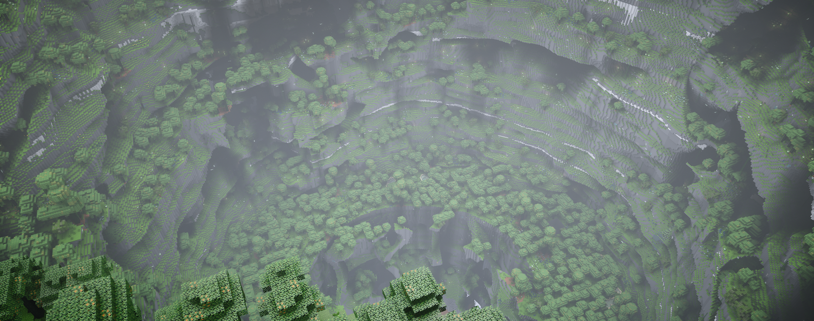

# Memento In Abyss

A Minecraft mod that introduces many new dimensions and items.

## Build

1. Use [IntelliJ IDEA](https://www.jetbrains.com/idea/) & [JDK 21](https://adoptium.net/temurin/releases/?os=any&version=21)
2. Run `gradlew runData`
3. Run `gradlew runClient`

## Contributing

Please read [CONTRIBUTING.md](CONTRIBUTING.md) before opening issues or pull requests.

## Download

(TBD)
